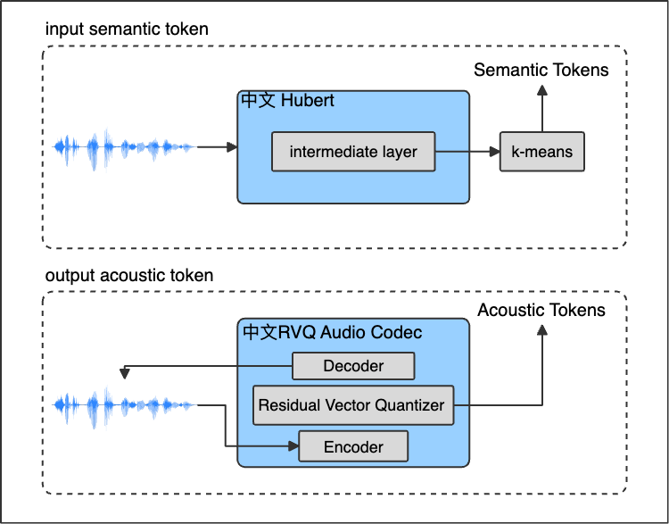
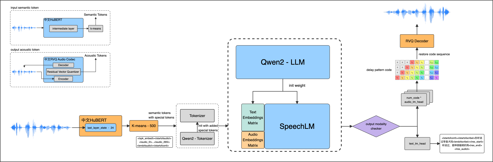

[Update]  
8.29 创建仓库，发布README & Roadmap  
8.31 发布Demo Site(https://voice-playground.91jzx.cn)  
9.12 发布Inference Code & 心流知镜-s-v0.2-checkpoint-20240828  


## 动机
尽管文本在互联网上是主要的语言形态，但许多场景如教学授课和医生问诊仍主要采用直接语音交流。此外，低龄儿童或不具备读写能力的人通过听说能力能够进行广泛的交流和表达，显示出纯语音交流具备足够的智能沟通能力。语音（Textless）交流天然包含丰富的表达信息，这在教育培训等场景中，相比纯粹的ASR文字转换，具有更高的信息价值。  
同时，本项目也受到 OpenAI 发布的 GPT-4o 和其展示的教育场景中的演示视频展现的能力的启发。


## 团队
浙江精准学是由阿里巴巴投资，专注于提供教育相关软硬件产品（AI辅学机）的公司。精准学 AI 团队致力于通过 AI 技术实现接近甚至超越人类教育体验的主动式学习，并力求降低技术成本，使之人人可负担。


## 背景
直接的语音端到端模型最早据我们所知，源自 Meta 的 Speechbot 系列的 GLSM。以下相关工作文献为我们的研究提供了宝贵的参考和实验经验：
- SpiritLM: Nguyen et al. (2024) 探索了口语和书面语言模型的交错。[详细信息][1]
- GLSM: Lakhotia et al. (2021) 从原始音频中生成口语语言模型。[详细信息][2]
- AudioLM: Borsos et al. (2023) 提出了一种音频生成的语言建模方法。[详细信息][3]
- SpeechGPT: Zhang et al. (2023) 强化了大型语言模型的内在跨模态对话能力。[详细信息][4]
- SpeechFlow: Liu et al. (2024) 介绍了一种配合流匹配的语音生成预训练方法。[详细信息][5]

[1]: https://arxiv.org/abs/2402.05755 "SpiRit-LM: Interleaved Spoken and Written Language Model"
[2]: https://arxiv.org/abs/2102.01192 "Generative Spoken Language Modeling from Raw Audio"
[3]: https://arxiv.org/abs/2209.03143 "AudioLM: a Language Modeling Approach to Audio Generation"
[4]: https://arxiv.org/abs/2305.11000 "SpeechGPT: Empowering Large Language Models with Intrinsic Cross-Modal Conversational Abilities"
[5]: https://arxiv.org/abs/2310.16338 "Generative Pre-training for Speech with Flow Matching"


## 方法
总体来说，我们把语音端到端模型的预训练看作一个对于语音蕴含的semantic和acoustic信息的representation的学习过程。从文本LLM初始化额外带来了统一的学习到Text & Audio Representation的可能性，也大幅度减少了工程量。所以我们按照如下两步设计整体训练思路。  

针对中文特别是支持教育场景语汇的自监督预训练语音编码器的缺乏，我们基于Meta HuBERT论文的方法开发了一个侧重语义信息的自监督语音编码器，并借鉴RVQVAE的方法，使用大量中文语音数据从头训练了侧重声学信息的音频编解码器（9层码本）。


基于这些自监督预训练的编解码器，我们使用 qwen2 系列 LLM 模型作为初始化参数，整体结构设计如图我们采用的非对称的结构。输入以 Semantic Unit 为主，输出为 Acoustic Unit 和文本同时输出。


FlowMirror-s v0.1和v0.2使用了2万小时和5万小时的语音数据进行端到端的预训练，并支持ASR、TTS、语音续写、语音对话等任务。这些实验结果初步验证了语音端到端模型的可行性，并且显示出网络设计的可扩展性，预示着模型在后续版本中能够获得更强的能力。


## 评估
定性音频的例子可以参考如下对话
```text
example_1 = "人在没有目标的时候才应该有压力"
example_2 = "这个阶段需要学习什么知识？"
example_3 = "怎么把事情做对要花时间去培养"
example_4 = "这里的药材长势不错"
```
### 对话语音例子
**对话例子1:** "人在没有目标的时候才应该有压力"  
[输入](assets/question_example_1_MP3.mp3)  
[输出](assets/answer_example_1_MP3.mp3)

**对话例子2:** "这里的药材长势不错"  
[输入](assets/question_example_4_MP3.mp3)  
[输出](assets/answer_example_4_MP3.mp3)

### Demo Site
相应的 Demo 实际体验部署在 https://voice-playground.91jzx.cn ，限于资源有限，同时支持并发小于10。实际部署的checkpoint是心流知镜-s v0.2-240822-checkpoint，后续会更新到v0.2和v0.3的最新的版本。

### 多任务评估
在这里ASR子任务被看作是对于语音中蕴含的learnable semantic info在预训练阶段对此representation学习效果的一个评估。当前的checkpoint，在预训练的第一阶段观察到ASR子任务大约相当于Whisper-small的水平。所选取的评估数据，公开领域网上语音数据是未训练的数据，Wenet数据全部未参与端到端训练过程。从这两部分数据随机采样1024条进行评估。 
| 数据集来源          | 数量    |  中文CER/WER     |
|-------------------|---------|---------|
| 公开领域随机采样 - test   | 1024（采样） | 12.55%  |
| WenetSpeech - test| 1024（采样） | 24.23%  |

因为此次发布的checkpoint是早期epoch，随着后续的训练数据量和时间的增加，在不增加神经网络参数量的前提下语音语义和文本之间的对齐方面可以看到会有很大的提升。

【TODO】
AudioBench的评估数据待添加  
PS: 亟待构建中文版的AudioBench以便更好的综合评估


## 限制与缺点
* 在3个数据阶段的训练中，我们没有使用常规的文本LLM预训练数据，预见到与原始qwen2模型相比，在MMLU评估上可能会有能力下降。后续版本将尝试减少这种能力下降。
* 当前版本仅对说话人音色进行了控制，其他语音信息如情感、韵律、语速、停顿、非言语声音、音高等未进行针对性调优。
* 对话有时会答非所问，或者回答错误的话题（例如语音特有的同音字造成的误解）。当前阶段限于1.5B 的参数量，以及预训练语音数据的特殊分布（不是均匀分布在各种对话话题）以及数据预处理的瓶颈的原因，我们认为随着数据量的增加以及针对性数据的加入，会大幅度改善这一问题。
* 当前版本还不支持多轮对话。
* 推理速度还有非常大的改善空间。目前在L20显卡上的TTFB是670ms左右，预计在针对TensorRT适配，以及一些其他流行技术的应用后，即使不考虑量化仍然有整体吞吐量的十几倍的加速空间存在。


## 许可证
由于在v0.1-v0.3的自监督Encoder中使用了WenetSpeech的数据集，我们发布的自监督预训练语音Encoder和端到端checkpoint权重文件仅限于学术使用。代码部分则遵循Apache 2.0协议。  
为了促进中文及亚洲地区语言的语音模型探索，我们将整理采集的公域数据，排除Wenet数据后训练一个新的版本，开放可以更加自由使用的自监督编码器和编解码器。


## 路径规划
预计本项目的工作规划如下

### 2024-8
**心流知镜-s v0.1 & 0.2 (5亿-15亿参数)**
- [x] 中文版自监督audio codec
- [x] 心流知镜-s v0.1 & v0.2 (5亿-15亿 参数)
- [x] 基于 webrtc 的体验网站
- [x] 语音 & 文字 双输出

⠀
### 2024-9
**心流知镜-s v0.2**
- [ ] 开源checkpoint和推理代码
- [ ] 推理加速版本
- [ ] 支持端侧部署
- [ ] 开放自监督speech encoder和Audio codec权重和代码供学术使用

⠀
### 2024-10
**心流知镜-s v0.3**
- [ ] 中小学科目教学增强
- [ ] 支持对话Speaker语音选择
- [ ] 语音Expressive表达（情绪、音量、高音、语速等）
- [ ] 中文为主的AudioBench评估数据集的构建

⠀
### 2024-11
**心流知镜-s v0.3-多语言版本**
- [ ] 支持东亚地区及全球主流语言
- [ ] 支持多语种交互对话

⠀
### 2024-12
**心流知镜-s v0.4**
- [ ] 支持高品质的教育教学场景全双工对话
- [ ] 更大参数量的模型尺寸

⠀
### 2025-1
**心流知镜-s v0.5**
- [ ] 对于中国各地方言及口音的支持

⠀
### 2025-3
**心流知镜-s1**
- [ ] 发布更大参数量的模型尺寸
- [ ] 对于视觉能力的扩展


## 招聘
以下方向均在招聘，也有课题组Leader角色，有兴趣的欢迎联络
- 语音 ASR/TTS/对话SLLM
- 角色扮演 LLM 模型
- 多模态模型推理加速
- 视觉理解，文档智能
- 通用框架的人物视频生成


## 同行社群
钉钉群：90720015617  

